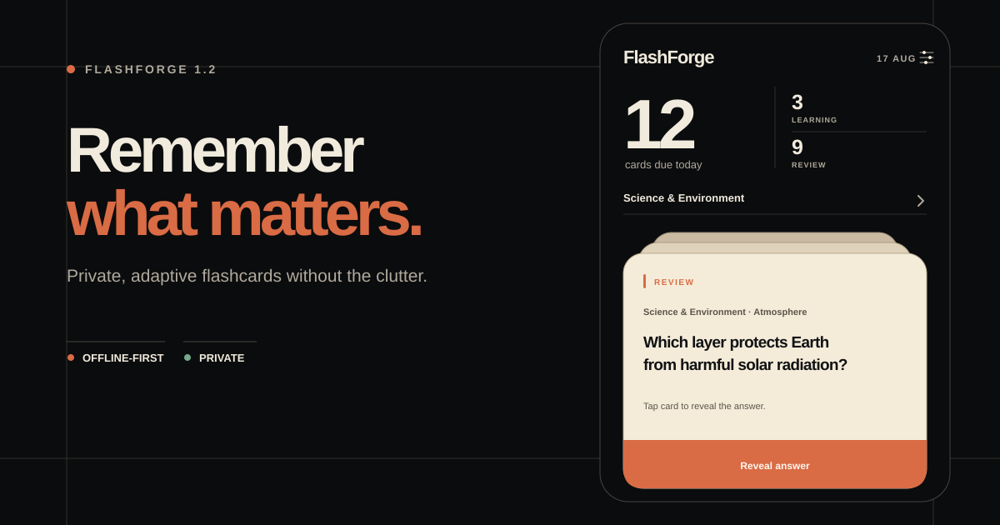

<p align="center">
  
</p>

<p align="center">
  
  
  
  
  
</p>

<p align="center">
  <a href="https://apps.apple.com/app/id6759084535">
    
  </a>
  &nbsp;&nbsp;
  <a href="https://bbdyno.github.io/FlashForge/">Website</a>
</p>

<p align="center"><sub>Apple and the Apple logo are trademarks of Apple Inc. App Store is a service mark of Apple Inc.</sub></p>

## 📱 About the App

**FlashForge** is a private, offline-first flashcard app powered by a hybrid spaced repetition engine. It combines **SM-2** with **FSRS (Free Spaced Repetition Scheduler)** to adapt review timing to actual recall while preserving the familiar front → reveal → grade study flow.

**FlashForge**는 검증된 **SM-2(Anki)** 알고리즘과 최신 **FSRS** 알고리즘을 결합한 하이브리드 간격 반복 엔진을 탑재한 오프라인 우선 플래시카드 앱입니다. 회원가입 없이 학습할 수 있으며 카드 내용은 기기와 사용자가 활성화한 iCloud에만 저장됩니다.

<br>

## ✨ Key Features / 주요 기능

### 🧠 Hybrid Spaced Repetition (하이브리드 간격 반복)
- **Dual Algorithm Engine:** Combines classic Anki SM-2 with modern FSRS for scientifically optimized review scheduling.
- **Adaptive Scheduling:** 17-parameter FSRS model dynamically adjusts to your learning patterns.
- **4-Grade Feedback:** Rate each card as Again, Hard, Good, or Easy for precise scheduling.
- **이중 알고리즘 엔진:** 클래식 SM-2와 최신 FSRS를 결합한 과학적 복습 스케줄링.
- **적응형 스케줄링:** 17개 매개변수 FSRS 모델이 학습 패턴에 맞춰 자동 조정됩니다.
- **4단계 피드백:** Again, Hard, Good, Easy로 세밀한 스케줄링이 가능합니다.

### 🃏 Deck & Card Management (덱 & 카드 관리)
- **Unlimited Decks:** Organize flashcards into topic-based decks.
- **Rich Card Content:** Each card supports front (question), back (answer), and optional notes.
- **Smart Queues:** Separate Learning and Review queues for focused study sessions.
- **무제한 덱:** 주제별로 플래시카드를 자유롭게 분류하세요.
- **풍부한 카드 콘텐츠:** 질문, 답변, 메모를 각 카드에 기록할 수 있습니다.
- **스마트 큐:** 학습(Learning)과 복습(Review) 큐를 분리하여 집중 학습이 가능합니다.

### 🎨 Soft Editorial UI (소프트 에디토리얼 디자인)
- **Familiar Usability:** Today, Library, and Insights keep their existing navigation and study behavior.
- **User-controlled Appearance:** Follow the system or explicitly select Light or Dark in Settings.
- **Tactile Visual Language:** Obsidian, warm paper, precise rules, and copper accents replace glossy or pixel-inspired decoration.
- **Custom Onboarding Art:** Theme-aware vector illustrations are drawn directly in UIKit rather than relying on generated or stock artwork.
- **익숙한 사용성:** Today, Library, Insights의 기존 탐색 구조와 학습 동작을 그대로 유지합니다.
- **사용자 선택 화면 모드:** 설정에서 시스템, 라이트, 다크 모드를 직접 선택할 수 있습니다.
- **절제된 시각 언어:** 흑요석색, 따뜻한 종이색, 얇은 구획선과 구리색 포인트로 화면을 구성했습니다.
- **직접 그린 온보딩:** 생성형·스톡 이미지 대신 UIKit 벡터 패스로 테마 대응 일러스트를 직접 그립니다.

### 📊 Study Analytics (학습 분석)
- **140-Day Heatmap:** Visual review activity calendar to track study consistency.
- **Due Card Summary:** Real-time display of learning and review card counts.
- **Progress Tracking:** Monitor card states — New, Learning, Review, Relearning.
- **140일 히트맵:** 학습 활동 캘린더로 꾸준한 공부 습관을 확인하세요.
- **복습 카드 요약:** 학습/복습 카드 수를 실시간으로 보여줍니다.
- **진도 추적:** New → Learning → Review → Relearning 카드 상태를 모니터링합니다.

### 🔔 Daily Reminders (학습 알림)
- **Push Notifications:** Configurable daily study reminders to build consistent habits.
- **Custom Timing:** Set your preferred reminder time.
- **푸시 알림:** 매일 학습 습관을 유지할 수 있도록 알림을 설정하세요.
- **맞춤 시간 설정:** 원하는 시간에 알림을 받을 수 있습니다.

### 💾 Data Portability (데이터 이식성)
- **Full Backup:** Export all decks, cards, and review history as `.ffbackup` files.
- **Easy Restore:** Import backups with preview before applying.
- **Offline-First:** Study content stays on your device and your private iCloud container. No sign-up is required.
- **Optional Diagnostics:** Firebase Analytics and Crashlytics are disabled until you enable them in Settings.
- **전체 백업:** 덱, 카드, 복습 기록을 `.ffbackup` 파일로 내보낼 수 있습니다.
- **간편 복원:** 적용 전 미리보기와 함께 백업을 가져올 수 있습니다.
- **오프라인 우선:** 학습 내용은 기기와 사용자의 비공개 iCloud 컨테이너에 저장되며 회원가입이 필요 없습니다.
- **선택적 진단:** Firebase Analytics와 Crashlytics는 설정에서 사용자가 켜기 전까지 비활성화됩니다.

### 🌍 Localization (다국어 지원)
- **2 Languages:** English and Korean.
- **2개 국어 지원:** 영어, 한국어를 지원합니다.

<br>

## Design Preview / 디자인 미리보기

The repository artwork and the [product website](https://bbdyno.github.io/FlashForge/) use the same Soft Editorial system as version 1.2.0: dark-first presentation, theme-aware surfaces, restrained motion, and a single warm accent.

저장소 이미지와 [제품 웹사이트](https://bbdyno.github.io/FlashForge/)는 버전 1.2.0 앱과 동일한 소프트 에디토리얼 디자인 시스템을 사용합니다. 다크 중심 화면, 테마 대응 표면, 절제된 모션과 하나의 따뜻한 포인트 색을 일관되게 적용했습니다.

<br>

---

## 🛠 Tech Stack

| Category | Technology |
|---|---|
| **Language** | Swift 5.9 |
| **UI Framework** | UIKit (Programmatic) |
| **Architecture** | MVVM |
| **Local Storage** | SwiftData |
| **Layout** | SnapKit |
| **Typography** | Manrope (SIL Open Font License 1.1) |
| **Concurrency** | Swift Concurrency (async/await, Actor) |
| **Scheduling** | SM-2 (Anki) + FSRS Hybrid |
| **Project Management** | Tuist |

<br>

---

## 🚀 Getting Started

This project uses [Tuist](https://tuist.io) for project generation and dependency management.

### Prerequisites
- Xcode 16.0 or later
- [mise](https://mise.jdx.dev/) installed

### Installation

```bash
# Install the pinned Tuist version, dependencies, and generated project
make install
```

This will run `tuist install` and `tuist generate` to set up the Xcode workspace.

### Available Commands

| Command | Description |
|---|---|
| `make install` | Install dependencies and generate Xcode project |
| `make clean` | Remove generated project files |

### Opening in Xcode

1. Open the workspace:
   ```bash
   open FlashForge.xcworkspace
   ```

2. **Important:** Select the correct scheme and destination
   - **Scheme:** Choose `FlashForge`
   - **Destination:** Select an iOS Simulator (e.g., iPhone 16)

3. Press `Cmd+R` to build and run

<br>

---

## 📂 Project Structure

```
FlashForge/
├── App/                    # AppDelegate, SceneDelegate
├── Models/                 # Domain models, FSRS parameters
├── Services/               # CardRepository, FSRSScheduler, SM2Scheduler
├── ViewModels/             # HomeViewModel, DecksViewModel, DeckDetailViewModel
├── ViewControllers/        # Study, Decks, DeckDetail, CardEditor, More, Onboarding
├── Views/                  # GlassCardView, ReviewHeatmapView
├── Resources/
│   ├── Fonts/              # Manrope + OFL license
│   └── AppAssets.xcassets/ # App icon and colors
├── Tests/                  # Unit tests
├── Tuist/                  # Tuist project configuration
└── Makefile
```

## Third-party fonts

FlashForge bundles **Manrope** from the official Google Fonts repository. It is
distributed under the SIL Open Font License 1.1; the full license is included at
`Resources/Fonts/Manrope-OFL.txt`.

<br>

---

## 💜 Support Me

<div align="left">
  <a href="https://buymeacoffee.com/bbdyno" target="_blank">
    
  </a>
</div>

<br>

<details>
<summary>
  <b>🪙 Crypto Donation (BTC / ETH)</b><br>
  <span style="font-size: 0.8em; color: gray;">Click to see QR Codes & Addresses</span>
</summary>

<br>

<table>
  <tr>
    <td align="center" width="200">
      
      <br><br>
      
      <br><br>
      <a href="bitcoin:bc1qz5neag5j4cg6j8sj53889udws70v7223zlvgd3"><b>Send BTC ↗</b></a>
    </td>
    <td align="center" width="200">
      
      <br><br>
      
      <br><br>
      <a href="ethereum:0x5f35523757d0e672fa3ffbc0f1d50d35fd6b2571"><b>Send ETH ↗</b></a>
    </td>
  </tr>
</table>

<blockquote>
<p><b>BTC:</b> <code>bc1qz5neag5j4cg6j8sj53889udws70v7223zlvgd3</code></p>
<p><b>ETH:</b> <code>0x5f35523757d0e672fa3ffbc0f1d50d35fd6b2571</code></p>
</blockquote>

</details>

<br>

> **Thanks for your support!** 🎁
>
> 🇰🇷 커피 한 잔의 후원은 저에게 큰 힘이 됩니다. 감사합니다! <br>
> 🇺🇸 Thanks for the coffee! Your support keeps me going. <br>
> 🇸🇦 شكراً على القهوة! دعمك يعني لي الكثير. <br>
> 🇩🇪 Danke für den Kaffee! Deine Unterstützung motiviert mich. <br>
> 🇫🇷 Merci pour le café ! Votre soutien me motive. <br>
> 🇪🇸 ¡Gracias por el café! Tu apoyo me motiva a seguir. <br>
> 🇯🇵 コーヒーの差し入れ、ありがとうございます！励みになります。 <br>
> 🇨🇳 感谢请我喝杯咖啡！您的支持是我最大的动力。 <br>
> 🇮🇩 Terima kasih traktiran kopinya! Dukunganmu sangat berarti.
